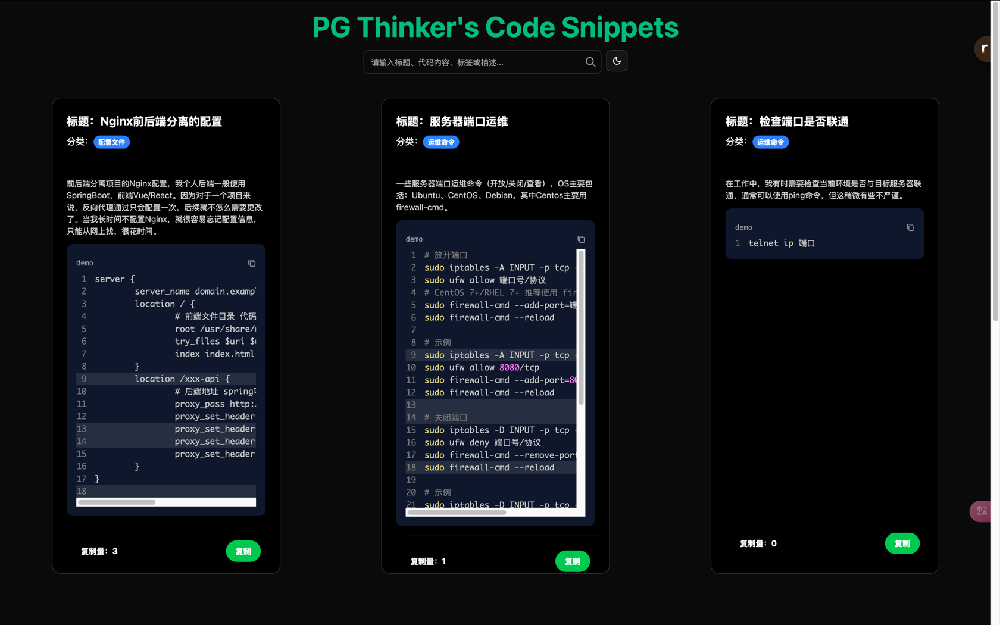

# 我的代码记忆片段库

- 演示地址:[https://code.pgthinker.me](https://code.pthinker.me)



## 为什么写这个项目？

&emsp;经常熬夜码造成记忆力有所下降，在平时的工作中，有很多代码、命令只是偶尔用，时间久了就不记得，这个时候又需要从网上搜或问AI，非常浪费时间。

&emsp;这个项目的目的是帮助我存储零散的知识，并在需要时从片段库中快速检索。通常，从在线搜索或人工智能查询中获得的答案都是通用的，但在实际工作中，代码或命令往往是特定于某些场景的。所以这个项目往往是用来存储生活中特定于某些场景下的内容，但不会限制存储一些通用的你需要的内容。

## 通过命令行工具推送

- `cnpt -h`

```text
A simple command-line tool for push or del code snippet.

Usage: cnpt <COMMAND>

Commands:
  init  init a config file
  set   set config key-value. key only be `password` or `api`. example: `cnpt set pwd 123456`
  push  push a code snippet to server. example: `cnpt push -t "hello world" -c "src/main.rs" -l "rust" -g "rust"`
  del   delete a code snippet from server. example: `cnpt del -i 1`
  info  print config info. example: `cnpt info`
  help  Print this message or the help of the given subcommand(s)

Options:
  -h, --help     Print help
  -V, --version  Print version
```

- `cnpt init`: 初始化一个配置文件，若之前有配置文件，则会进行备份。配置文件内部主要就两个内容，api和password。
- `cnpt set [key] [value]`: 配置设置，`key`仅支持`api`或`password`.
- `cnpt info`: 查看配置信息
- `cnpt push -t [标题] -c [代码片段文件位置] -l [语言] -g [标签]`: 推送一条代码片段到存储库中。执行后，需要输入一些描述信息，可以为空。
- `cnpt del -i [id]`: 根据指定代码片段的id进行删除。


```shell
cnpt push -t "测试" -c "../../code.rs" -l "txt" -g "测试标签" 

Please input the code snippet's description:
这是一段测试push命令的描述

[2025-03-22T18:48:02Z INFO  cnpt::command::push] Push successful!
```

